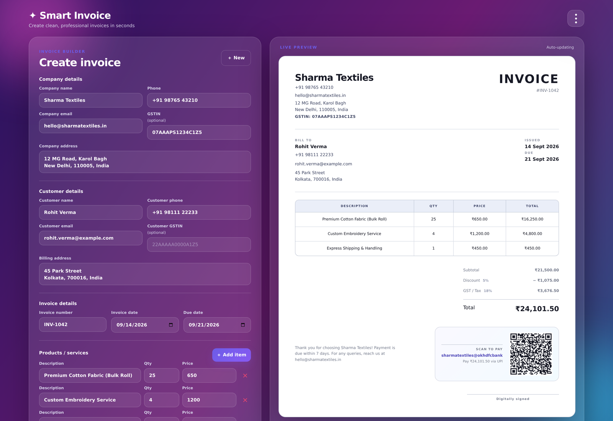
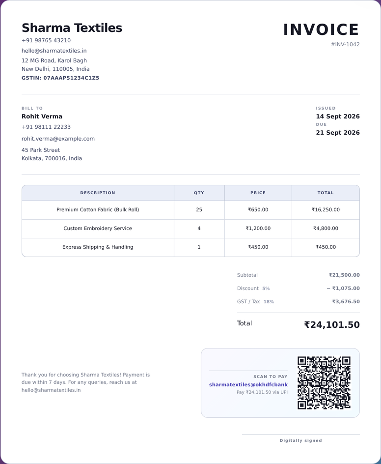
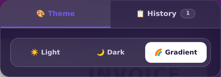
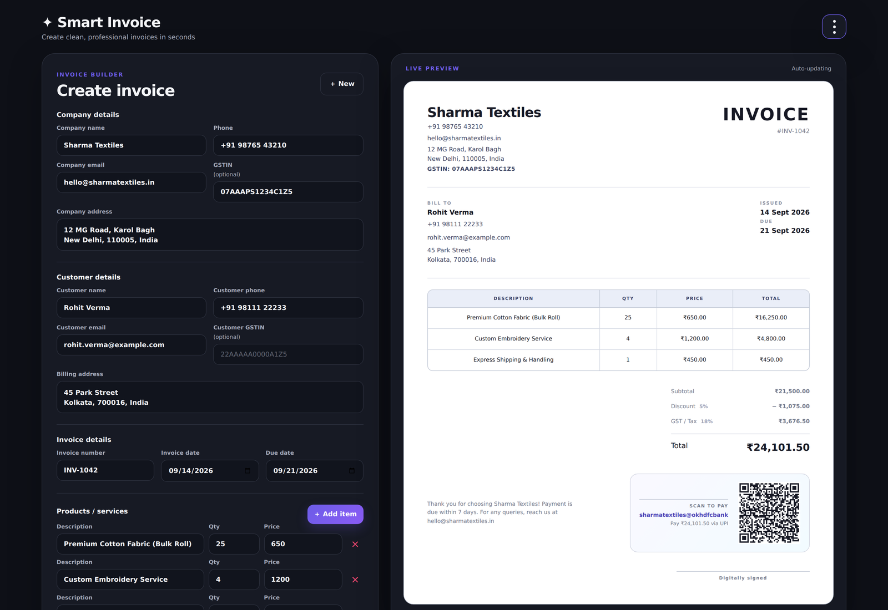
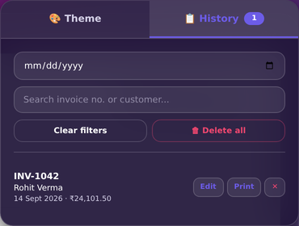
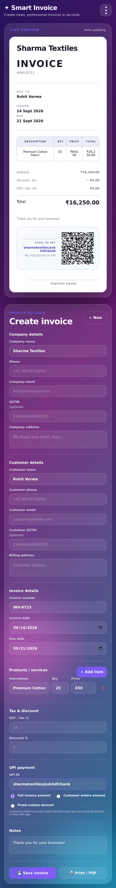
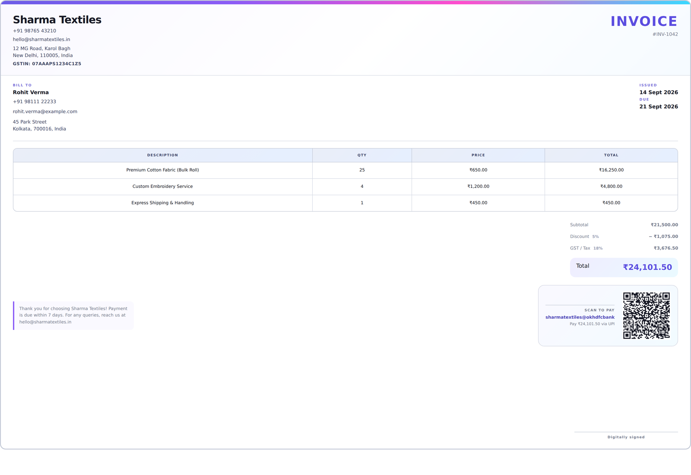

# ✦ Smart Invoice Generator

A single-file, no-build invoice generator that runs entirely in the browser. Fill in the form on the left, watch a polished invoice render live on the right, then save it to local history, print it, or export it as a PDF.

## ✨ Features

- **Live invoice preview** — every field updates instantly.
- **Company, customer, items, tax & discount** — complete invoice fields including GSTIN and multi-item billing.
- **UPI QR payments** — generate a scannable QR code with full amount, customer-entered amount, or fixed custom amount.
- **Notes + QR alignment** — notes stay aligned even when the QR code is hidden.
- **Invoice history** — save, search, edit, print, and delete invoices using browser `localStorage`.
- **Print / PDF export** — optimized print stylesheet for a clean invoice.
- **3 themes** — Light, Dark, and Gradient.
- **Responsive design** — clean single-column layout on mobile.
- **No backend or build tools** — works as a static HTML project.

---

## 📸 Complete App Screenshots

The following screenshots are included in this project and can be viewed directly on GitHub.

### 1. Full App — Gradient Theme

Editor on the left and live invoice preview on the right.



### 2. Invoice Preview with QR

Generated invoice showing customer details, items, totals, and UPI QR payment.



### 3. Notes + QR Row — QR Visible

Notes and the UPI QR payment section are displayed in the same row.


### 4. Notes + QR Row — QR Hidden

When no UPI ID is entered, the QR disappears but the notes remain in the same position.


### 5. Theme Menu

The three-dot menu provides access to the available themes and app controls.



### 6. Full App — Dark Theme

Complete application view using the Dark theme.



### 7. Invoice History Panel

Saved invoices can be searched and managed from the History panel.



### 8. Mobile / Responsive View

The application automatically changes to a single-column layout on smaller screens.



### 9. Print / PDF Preview

The print layout is optimized for printing or saving the invoice as a PDF.



---

## 🖼️ Screenshot Gallery

| Gradient Theme | Invoice + QR |
|---|---|
|  |  |

| Notes + QR | Notes without QR |
|---|---|
|  |  |

| Theme Menu | Dark Theme |
|---|---|
|  |  |

| History | Mobile View |
|---|---|
|  |  |

| Print / PDF |
|---|
|  |

---

## 🗂 Project Structure

This is a **single HTML file** project. CSS and JavaScript are included inside `index.html`.

```text
New folder/
├── index.html
├── README.md
├── 01-full-app-gradient.png
├── 02-invoice-preview-with-qr.png
├── 03-notes-qr-row-filled.png
├── 04-notes-qr-row-empty.png
├── 05-theme-menu.png
├── 06-full-app-dark.png
├── 07-history-panel.png
├── 08-mobile-view.png
└── 09-print-preview.png
```

> **Important:** Keep the PNG screenshots in the same folder as `README.md`. GitHub uses the relative paths above to display them.

---

## 🚀 How to Run

No installation or build step is required.

1. Open the project folder.
2. Double-click `index.html`.
3. The application will open in your browser.
4. Start entering invoice details.

You can also host the project on GitHub Pages or another static hosting service.

---

## 🧾 How to Use

1. Enter your company details.
2. Enter customer details.
3. Add invoice items with quantity and price.
4. Set tax and discount if required.
5. Add a UPI ID to display the Scan-to-Pay QR code.
6. Add notes or a thank-you message.
7. Save the invoice to browser history.
8. Use **Print / PDF** to print or save the invoice as a PDF.

All invoice history and theme settings are stored locally in the browser using `localStorage`.

---

## 🛠️ Technologies Used

- HTML5
- CSS3
- JavaScript
- CSS Grid / Flexbox
- Browser `localStorage`
- QRCode.js

The QR library is loaded from a CDN:

```html
<script src="https://cdnjs.cloudflare.com/ajax/libs/qrcodejs/1.0.0/qrcode.min.js" defer></script>
```

---

## 📱 Responsive Design

The application supports desktop and mobile screens. On smaller screens, the editor and invoice preview switch to a single-column layout.

---

## ⚠️ Screenshot Note

The data visible in the screenshots is **demo/placeholder data** used to demonstrate the application's features. It is not intended to represent real customer or business information.

---

## 📌 GitHub Tip

When uploading this project to GitHub, upload **all files together**, especially:

- `index.html`
- `README.md`
- all `01-*.png` through `09-*.png` screenshots

If the screenshots are uploaded with the same filenames and folder structure shown above, GitHub will automatically display them inside this README.
