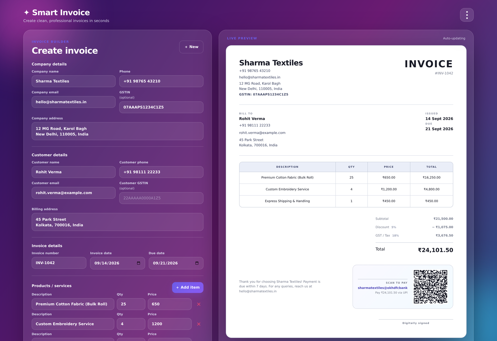
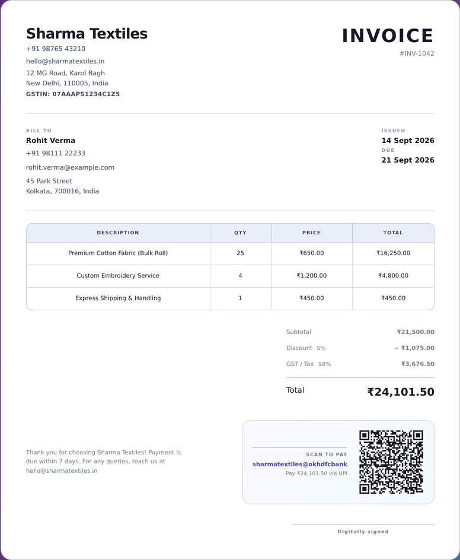
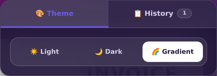
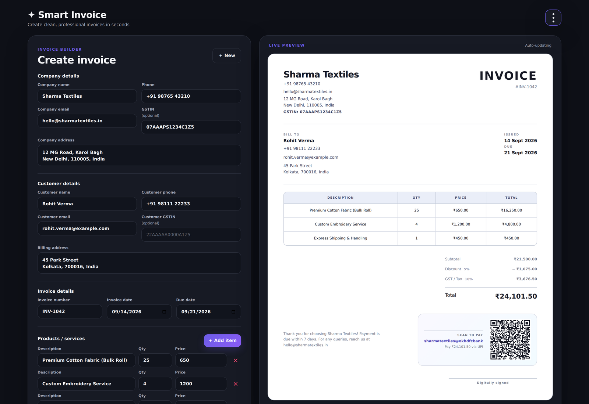
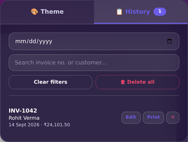
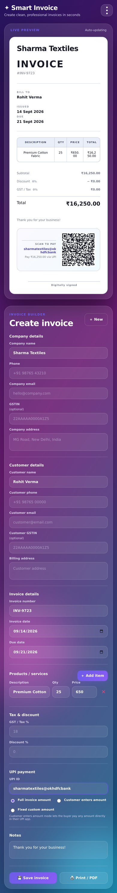
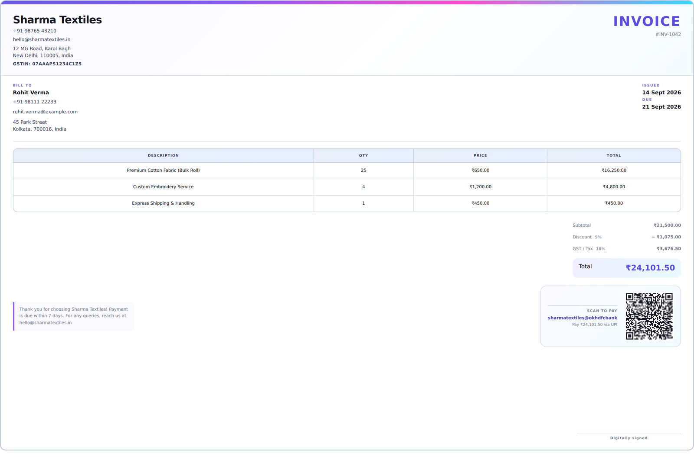

# 🧾 Smart Invoice Generator

<p align="center">
  <strong>A modern, browser-based invoice generator with live preview, UPI QR payments, invoice history, themes, and print-ready PDF export.</strong>
</p>

<p align="center">
  <a href="https://tech-ankit-kumar.github.io/smart-invoice-generator/">
    
  </a>
  <a href="https://github.com/tech-ankit-kumar/smart-invoice-generator">
    
  </a>
</p>

<p align="center">
  
  
  
  
</p>

---

## 📌 About the Project

**Smart Invoice Generator** is a lightweight, browser-based invoice creation application built to make professional invoice generation simple and fast.

The application provides a complete invoice workflow inside a single web page. Users can enter company and customer information, add multiple billing items, apply tax and discounts, generate a UPI payment QR code, preview the invoice in real time, save invoices locally, search invoice history, and print or save invoices as PDF.

The project is intentionally built without a backend or build system, making it easy to run locally and deploy as a static website.

> 🎯 **Goal:** Provide a simple, professional, and privacy-friendly invoice generation tool that works directly in the browser.

---

## 🌐 Live Demo

### 🚀 Try Smart Invoice Generator Online

**[👉 Open Live Website](https://tech-ankit-kumar.github.io/smart-invoice-generator/)**

No installation or backend setup is required.

---

## ✨ Key Features

### 🧾 Live Invoice Preview

Create an invoice while seeing the final result update instantly.

- Real-time field updates
- Professional invoice layout
- Company information
- Customer information
- Invoice details
- Multi-item billing
- Automatic totals
- Tax calculation
- Discount support

---

### 🏢 Company & Customer Details

Add important billing information including:

- Company name
- Company address
- Contact details
- GSTIN
- Customer name
- Customer address
- Customer contact information
- Invoice number
- Invoice date

---

### 🛒 Multi-Item Billing

Add multiple products or services to the invoice.

- Item description
- Quantity
- Price
- Automatic line totals
- Multiple invoice items
- Dynamic item management

---

### 💰 Tax & Discount

Customize invoice totals according to your billing requirements.

- Tax percentage
- Discount amount/percentage support
- Automatic calculations
- Updated totals in real time

---

### 📱 UPI QR Payment

Generate a scannable UPI payment QR code directly inside the invoice.

The QR payment section supports:

- UPI ID
- Full invoice amount
- Customer-entered amount
- Fixed custom amount
- Scan-to-pay workflow

---

### 📝 Notes & QR Alignment

Add notes or a thank-you message to the invoice.

The layout keeps the notes section aligned correctly whether the UPI QR code is visible or hidden.

---

### 🗂️ Invoice History

Save invoices directly in the browser and manage them later.

- Save invoices
- Search invoices
- Edit saved invoices
- Print saved invoices
- Delete invoices
- Local browser storage

---

### 🖨️ Print & PDF Export

Generate a clean print-ready version of your invoice.

- Print-friendly layout
- Optimized print stylesheet
- Save as PDF through the browser print dialog
- Clean invoice output

---

### 🎨 Multiple Themes

Choose the visual style that fits your preference.

- ☀️ Light Theme
- 🌙 Dark Theme
- 🌈 Gradient Theme

---

### 📱 Responsive Design

The application adapts to different screen sizes.

On smaller screens, the editor and invoice preview automatically switch to a clean single-column layout.

---

## 📸 Complete App Screenshots

### 1. 🖥️ Full App — Gradient Theme



Complete application view with the invoice editor and live preview.

---

### 2. 🧾 Invoice Preview with QR



Generated invoice showing billing information, totals, and UPI payment QR.

---

### 3. 📝 Notes + QR Row — QR Visible


Notes and UPI QR payment section displayed together.

---

### 4. 📝 Notes + QR Row — QR Hidden


The notes section remains correctly aligned when the QR code is hidden.

---

### 5. 🎨 Theme Menu



Theme and application controls available through the menu.

---

### 6. 🌙 Full App — Dark Theme



Complete application view using the dark theme.

---

### 7. 🗂️ Invoice History



Saved invoices can be searched and managed from the history panel.

---

### 8. 📱 Mobile / Responsive View



Responsive single-column layout for smaller screens.

---

### 9. 🖨️ Print / PDF Preview



Print-optimized invoice layout for printing or saving as PDF.

---

## 🛠️ Tech Stack

| Technology | Purpose |
|---|---|
| **HTML5** | Application structure |
| **CSS3** | Styling, themes, layout, and responsiveness |
| **JavaScript** | Invoice logic, calculations, history, QR generation, and interactions |
| **CSS Grid / Flexbox** | Responsive application layout |
| **localStorage** | Local invoice history and settings |
| **QRCode.js** | UPI QR code generation |
| **GitHub Pages** | Static hosting and deployment |

---

## 📦 Project Structure

```text
smart-invoice-generator/
│
├── index.html
├── README.md
│
├── 01-full-app-gradient.png
├── 02-invoice-preview-with-qr.png
├── 03-notes-qr-row-filled.png
├── 04-notes-qr-row-empty.png
├── 05-theme-menu.png
├── 06-full-app-dark.png
├── 07-history-panel.png
├── 08-mobile-view.png
└── 09-print-preview.png
```

The project is intentionally kept simple: the main HTML file contains the application's structure, styling, and JavaScript logic.

---

## 🚀 Getting Started

### Option 1 — Open Directly

1. Download or clone the repository.
2. Open the project folder.
3. Double-click `index.html`.
4. The application will open in your browser.
5. Start creating invoices.

### Option 2 — VS Code

1. Open the project folder in **Visual Studio Code**.
2. Open `index.html`.
3. Run it in your browser.
4. Start entering invoice details.

No `npm install`, build command, or backend server is required.

---

## 📥 Clone the Repository

```bash
git clone https://github.com/tech-ankit-kumar/smart-invoice-generator.git
cd smart-invoice-generator
```

Then open `index.html` in your browser.

---

## 🧭 How to Use

### 1. Enter Company Details
Add your business/company information and GSTIN if required.

### 2. Enter Customer Details
Add the customer's billing information.

### 3. Add Invoice Items
Enter products or services with quantity and price.

### 4. Configure Tax & Discount
Apply the required tax and discount values.

### 5. Add UPI Payment Details
Enter a UPI ID if you want to display a Scan-to-Pay QR code.

### 6. Add Notes
Add payment instructions, terms, or a thank-you message.

### 7. Review the Live Preview
Check the invoice as it updates in real time.

### 8. Save to History
Save the invoice locally so it can be accessed later.

### 9. Print or Save as PDF
Use the print option to print the invoice or save it as a PDF.

---

## 💾 Data & Privacy

Smart Invoice Generator is designed as a client-side application.

- No backend server is required.
- Invoice history is stored locally in the browser.
- Theme/settings data is stored locally.
- Invoice information is not uploaded to a project backend.
- Clearing browser storage can remove locally saved invoice history.

> ⚠️ **Important:** Do not enter sensitive information into a public/shared computer or browser profile.

---

## 🔗 QR Code Library

The application uses **QRCode.js** for generating UPI QR codes.

```html
<script src="https://cdnjs.cloudflare.com/ajax/libs/qrcodejs/1.0.0/qrcode.min.js" defer></script>
```

---

## 💼 Portfolio Highlights

This project demonstrates practical frontend development skills including:

- Dynamic form handling
- Real-time UI updates
- DOM manipulation
- Invoice calculations
- Tax and discount calculations
- Multi-item billing
- QR code generation
- Browser localStorage
- Search and history management
- Edit/delete workflows
- Theme switching
- Responsive web design
- Print-specific CSS
- PDF-friendly layouts
- Single-page application behavior

---

## 🔮 Future Enhancements

Possible future improvements include:

- ☁️ Cloud invoice synchronization
- 🔐 User authentication
- 🗄️ Online database
- 📧 Email invoice delivery
- 📄 Multiple invoice templates
- 🧾 Recurring invoices
- 💳 More payment methods
- 📊 Sales and invoice analytics
- 📤 Invoice sharing
- 🌍 Multi-currency support
- 🌐 Multi-language support
- 🏢 Business profile management

---

## 🤝 Contributing

Suggestions, improvements, and contributions are welcome.

To contribute:

1. Fork the repository.
2. Create a new branch.
3. Make your changes.
4. Commit your changes.
5. Open a pull request.

---

## ⭐ Support the Project

If you find **Smart Invoice Generator** useful:

- ⭐ Star the repository
- 🍴 Fork the project
- 💡 Suggest improvements
- 🐛 Report bugs
- 📢 Share the project

---

## 📄 License

This project is created for **educational and portfolio purposes**.

You are welcome to explore the source code and use it for learning.

---

## 👨‍💻 Author

### **Ankit Kumar**

**Smart Invoice Generator** — A browser-based invoice creation and management application.

- 💻 GitHub: [@tech-ankit-kumar](https://github.com/tech-ankit-kumar)
- 🚀 Live Demo: [Smart Invoice Generator](https://tech-ankit-kumar.github.io/smart-invoice-generator/)
- 📦 Repository: [smart-invoice-generator](https://github.com/tech-ankit-kumar/smart-invoice-generator)

---

## 📌 Project Summary

**Smart Invoice Generator** combines:

> **Live Invoice Creation + Real-Time Preview + Tax & Discount + UPI QR Payments + Invoice History + Themes + Print/PDF Export**

into one lightweight browser-based invoicing solution.

<p align="center">
  <strong>🧾 Create. Preview. Save. Print.</strong>
</p>
